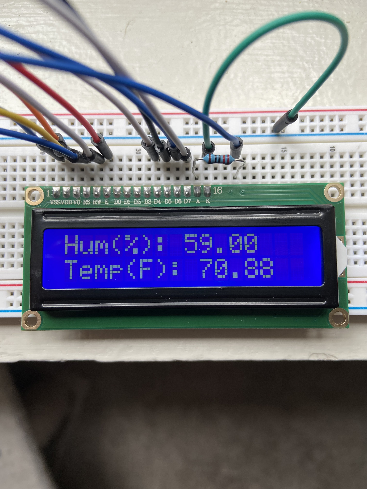
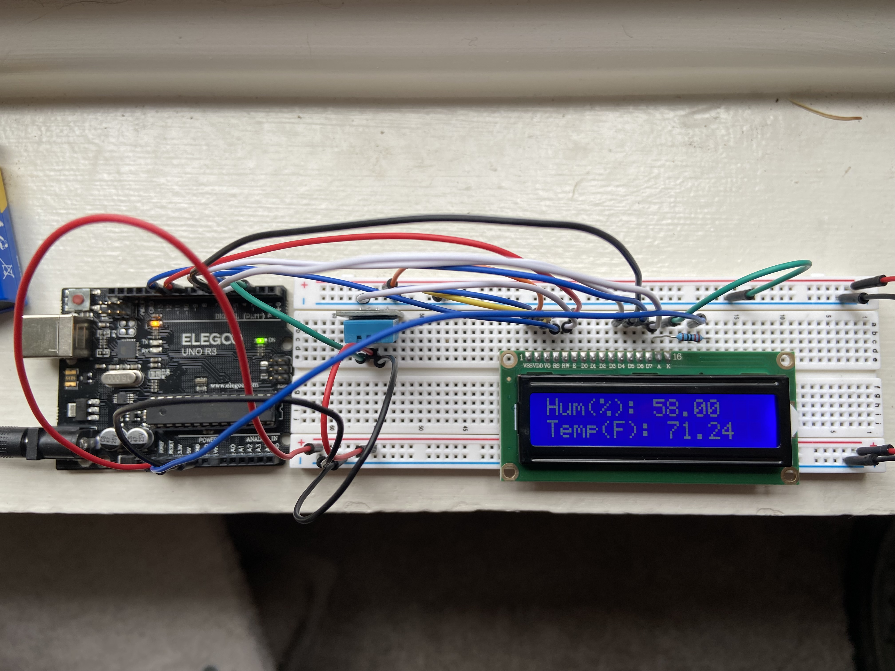

# Arduino Temperature and Humidity Monitor

## Overview:
This project implements a temperature and humidity monitoring system using an Arduino board, a DHT11 sensor, and an LCD display. It aims to provide a simple yet effective way to measure and display environmental conditions in real-time.

## Features:

- Reads temperature and humidity data from the DHT11 sensor.
- Displays the data on an LCD screen in Fahrenheit.
- Easy to set up and customize.

## Hardware Utilized

- Arduino UNO R3
- 830-point Breadboard
- DHT11 Temperature and Humidity Module
- LCD1602
- Jumper wires
- 9V battery with snap-on connector

## Photos

.jpg)

## Contributing

Contributions are welcome! If you find any issues or have suggestions for improvement, please open an issue or submit a pull request on GitHub.

## License

Copyright 2024 - William Legg

Permission is hereby granted, free of charge, to any person obtaining a copy of this software and associated documentation files (the “Software”), to deal in the Software without restriction, including without limitation the rights to use, copy, modify, merge, publish, distribute, sublicense, and/or sell copies of the Software, and to permit persons to whom the Software is furnished to do so, subject to the following conditions:

The above copyright notice and this permission notice shall be included in all copies or substantial portions of the Software.

THE SOFTWARE IS PROVIDED “AS IS”, WITHOUT WARRANTY OF ANY KIND, EXPRESS OR IMPLIED, INCLUDING BUT NOT LIMITED TO THE WARRANTIES OF MERCHANTABILITY, FITNESS FOR A PARTICULAR PURPOSE AND NONINFRINGEMENT. IN NO EVENT SHALL THE AUTHORS OR COPYRIGHT HOLDERS BE LIABLE FOR ANY CLAIM, DAMAGES OR OTHER LIABILITY, WHETHER IN AN ACTION OF CONTRACT, TORT OR OTHERWISE, ARISING FROM, OUT OF OR IN CONNECTION WITH THE SOFTWARE OR THE USE OR OTHER DEALINGS IN THE SOFTWARE.

## Acknowledgments:

Special thanks to the authors of the DHT library and LiquidCrystal library for their contributions to the Arduino ecosystem.